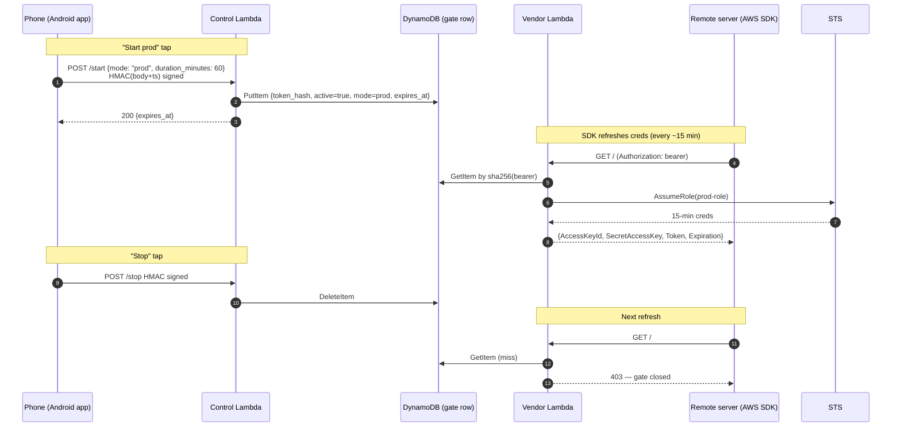

# phone-aws-auth

Toggle AWS access on a remote machine from your phone. Choose **prod** or **sandbox**. Tap once to open the gate, tap again to close it.

The phone never holds long-lived AWS credentials. The remote machine never holds long-lived AWS credentials. Both hold short, narrowly-scoped tokens. AWS-side roles do all the privileged work, and the phone just flips a flag that decides whether those roles will mint short-lived STS sessions for the machine.

---

## Problem

A remote server (a dev box, a Hetzner VM, a Codespace, an LLM agent runtime, etc.) sometimes needs AWS access for specific tasks, but most of the time should have none. Long-lived keys on the server are unacceptable; logging into the server to paste fresh keys is annoying.

We want:

1. Open the phone, tap "Start prod" (or "Start sandbox") → server has AWS access.
2. Tap "Stop" → server loses access.
3. Phone is the only place where the *authority* to grant access lives. Losing the server doesn't expose the AWS root account; losing the phone doesn't expose AWS credentials either (see [Security model](#security-model)).

---

## Architecture



Three things to note:

- The **phone never talks to the server** and the server never talks to the phone. They communicate indirectly through AWS (DynamoDB + Lambda). Server can be on a network with no inbound connectivity.
- The **server's bearer token is stable** — set once at provisioning, never rotated by normal operation. Only the gate row changes.
- The **SDK auto-refreshes** creds because we speak the [ECS container-credentials protocol](https://docs.aws.amazon.com/sdkref/latest/guide/feature-container-credentials.html). The server never sees creds older than 15 minutes.

---

## Components

| Component             | Hardcoded name           | Purpose                                                      |
|-----------------------|--------------------------|--------------------------------------------------------------|
| CloudFormation stack  | `phone-aws-auth`         | Single stack containing everything below                     |
| Region                | `eu-west-1`              | Single region for MVP                                        |
| DynamoDB table        | `phone-aws-gate`         | Stores the open/closed gate row, keyed by `token_hash`       |
| DynamoDB table        | `phone-aws-nonces`       | Replay-protection: stores consumed HMAC nonces with short TTL |
| Vendor Lambda         | `phone-aws-vendor`       | Server hits this for fresh STS creds                         |
| Control Lambda        | `phone-aws-control`      | Phone hits this to open/close the gate                       |
| Prod role             | `phone-aws-prod-role`    | Role the vendor assumes when `mode=prod`                     |
| Sandbox role          | `phone-aws-sandbox-role` | Role the vendor assumes when `mode=sandbox`                  |
| Lambda execution role | `phone-aws-lambda-role`  | Execution role for both Lambdas                              |

### Why hardcoded?

To eliminate one whole class of configuration error. The Android app, the deploy scripts, and the IAM policies all reference these names directly. If you deploy this stack to your own AWS account, **you must use these exact names**, otherwise the app's startup health check will fail and refuse to operate.

If you need multiple deployments in the same account (e.g. one per dev), that's a future-work item — see [Open questions](#open-questions).

---

## Security model

This is the core of the design. Read carefully.

### What the phone stores

| Item                        | Where stored                                         | If phone is stolen                                          |
|-----------------------------|------------------------------------------------------|-------------------------------------------------------------|
| HMAC secret                 | Android Keystore, hardware-backed, biometric-gated   | Attacker cannot extract it; cannot use it without biometric |
| Control Lambda URL          | App preferences (plaintext)                          | Not secret — public function URL                            |
| Cached gate status          | App preferences (plaintext)                          | Not secret — just a UI hint                                 |
| AWS access keys             | **Never**                                            | N/A                                                         |
| Server bearer token         | **Never**                                            | N/A                                                         |

The phone has exactly one secret: the **HMAC key** used to authenticate calls to the control Lambda. It is generated inside the Android Keystore and *never leaves the secure element*. We require biometric authentication on every signing operation (`setUserAuthenticationRequired(true)`), so a thief who unlocks the device still cannot sign requests without your fingerprint or face.

If the phone is lost: rotate the HMAC secret (which requires AWS deploy credentials, kept on your laptop, not the phone). The old key becomes useless.

### What the server stores

| Item                                       | Where                                | Notes                              |
|--------------------------------------------|--------------------------------------|------------------------------------|
| `AWS_CONTAINER_CREDENTIALS_FULL_URI`       | Env var (or `~/.aws/config`)         | The vendor Lambda's function URL   |
| `AWS_CONTAINER_AUTHORIZATION_TOKEN`        | Env var                              | The bearer token                   |

That's it. The server holds a static bearer token that, *by itself*, can do nothing — the gate is closed by default. The bearer only becomes useful while the phone has the gate open, and even then it only mints 15-minute STS sessions.

If the server is compromised:

- Attacker can call the vendor Lambda but gets 403 unless the gate happens to be open at that moment.
- If the gate *is* open when the server is compromised, the attacker gets 15-min creds for whichever role is active (prod or sandbox). Same exposure as if you'd put AWS keys on the server temporarily — but limited to the window when you happen to be granting access.
- Rotation: change the bearer token's `token_hash` in DynamoDB (which means re-pairing the phone with a freshly generated bearer); update the server's env var.

### What lives on the operator's laptop

| Item                              | When needed              | Notes                                                              |
|-----------------------------------|--------------------------|--------------------------------------------------------------------|
| AWS admin credentials             | Deploy / rotate / repair | Use [aws-token-vending-machine][tvm] to mint these short-lived     |
| Generated bearer token            | At deploy time only      | Shown once. Paste into the server's env. Then delete from laptop. |
| Generated HMAC secret             | At pairing time only     | Shown once as QR code. Phone scans. Then delete from laptop.      |

[tvm]: https://github.com/alexeygrigorev/aws-token-vending-machine

### Threat scenarios

| Threat                          | Outcome                                                                                          |
|---------------------------------|--------------------------------------------------------------------------------------------------|
| Phone lost, locked              | Hardware-backed HMAC key cannot be extracted. No exposure.                                       |
| Phone lost, unlocked, no biometric | Attacker can open the gate. But they don't have the server's bearer, so cannot mint creds. They could open the gate hoping the legitimate server fetches creds and is somehow compromised — narrow attack. |
| Phone lost, coerced biometric   | Attacker opens the gate. Server (if uncompromised) fetches creds and uses them legitimately. Operator detects via push notification (future work) and revokes. |
| Server fully compromised        | Attacker has bearer, but gate is usually closed → 403. When opened: 15-min creds for current mode. Same blast radius as a brief direct credential grant. |
| Control Lambda compromised      | Game over for the gate. IAM blast radius is still bounded by prod/sandbox role policies.         |
| DynamoDB row tampered           | Only the Lambda role and the operator's AWS admin can write to the table. Not externally reachable. |
| Replay attack on control Lambda | HMAC includes timestamp + nonce; Lambda rejects ts older than 60s and dedupes nonces within the window. |

### Why an HMAC and not OAuth / Cognito / mTLS / IAM SigV4

- **HMAC + timestamp + nonce** is ~30 lines of code on both sides, requires no external identity provider, and the secret is a single string we can put in the Android Keystore as a hardware-bound key.
- IAM SigV4 from a phone would require either embedding an IAM user's keys (which we're explicitly avoiding) or Cognito (complexity we don't need for a single-user toy).
- mTLS is overkill and harder to provision on Android.
- Trade-off: HMAC means a shared secret. Acceptable because there's exactly one client and the secret never leaves the secure element.

---

## Operational details

### Startup health check

When the Android app launches, it calls `GET /status` on the control Lambda (HMAC-signed). The Lambda:

1. Verifies the table `phone-aws-gate` exists and is readable.
2. Verifies both roles `phone-aws-prod-role` and `phone-aws-sandbox-role` exist.
3. Reads the current gate row (if any).
4. Returns a structured response:

```json
{
  "stack_name": "phone-aws-auth",
  "region": "eu-west-1",
  "resources_ok": true,
  "prod_role_arn": "arn:aws:iam::123456789012:role/phone-aws-prod-role",
  "sandbox_role_arn": "arn:aws:iam::123456789012:role/phone-aws-sandbox-role",
  "gate": { "active": true, "mode": "sandbox", "expires_at": 1716300000 }
}
```

The app checks `stack_name == "phone-aws-auth"` and `resources_ok == true`. If either fails, the app shows a "stack not deployed correctly" error and refuses to expose Start/Stop buttons. This is the user's "if things exist, continue; if not, stop" requirement.

### Stop semantics

`POST /stop` deletes the gate row in DynamoDB. The vendor Lambda's next call returns 403. The AWS SDK on the server sees the 403 on its next scheduled refresh (within 15 minutes), at which point any in-flight AWS calls will start failing.

**Default mode**: graceful — existing 15-minute creds finish out their natural life. The server's running processes get up to 15 minutes of stale-but-valid AWS access after you tap Stop.

**Instant kill** (optional, opt-in via a setting): in addition to deleting the row, the control Lambda attaches a deny policy to the active role with an `aws:TokenIssueTime < now` condition. Every live session for that role is invalidated immediately. On next "Start" the policy is removed. We do not enable this by default because the deny policy edits live IAM and is more invasive; it's a panic button.

### Session duration & auto-refresh

- **STS session duration**: 900 seconds (15 minutes — the STS minimum). Hardcoded.
- The AWS SDK on the server uses the [container credentials provider chain](https://docs.aws.amazon.com/sdkref/latest/guide/feature-container-credentials.html). It automatically re-fetches before expiry, transparent to user code.
- The server's session can therefore last as long as the gate is open, regardless of the 15-minute STS limit.

### Gate TTL safety net

The gate row has a `expires_at` field which is also the DynamoDB TTL attribute. If you tap Start with `duration_minutes=60`, the row is written with `expires_at=now+3600`. If you forget to tap Stop and your phone dies, DDB TTL will delete the row within roughly 48 hours (TTL is not instant — typically tens of minutes, but AWS guarantees only "within 48 hours"). The vendor Lambda also checks `expires_at > now` on every call, so the gate is effectively closed the moment `expires_at` passes even if the row hasn't been deleted yet.

### Sessions and per-tap duration

The default tap opens the gate for 60 minutes. The Android app has a duration picker (15min / 1h / 4h / 8h) — the value goes in `duration_minutes` on the `/start` request. The control Lambda enforces a server-side max (24 hours) to limit the damage of a coerced tap.

### One server per deployment (MVP)

This MVP supports exactly one server per stack. The gate row is keyed by `token_hash`, which is conceptually multi-server-ready, but the Android app's UI assumes a single gate. See [Open questions](#open-questions).

---

## Bootstrap & deploy

You will need:

- An AWS account (the management/main account, or a sub-account you control)
- AWS admin credentials *temporarily*, on your laptop, only during deploy
- A phone running Android 9+ (API 28+) with a biometric sensor
- The remote server you want to grant access to

### Steps

1. **(Optional) Create a sandbox account** using [aws-token-vending-machine][tvm]'s `setup-sandbox` command. This gives you a separate AWS account for the `phone-aws-sandbox-role` to live in, so prod and sandbox are physically isolated. You can also point both roles at the same account for MVP simplicity.

2. **Deploy the stack** from this repo:

   ```sh
   ./deploy.sh
   ```

   Outputs (shown once):
   - Vendor Lambda URL
   - Control Lambda URL
   - Server bearer token
   - Phone HMAC secret (as a QR code in the terminal)

3. **Configure the server**:

   ```sh
   export AWS_CONTAINER_CREDENTIALS_FULL_URI='<vendor-url>'
   export AWS_CONTAINER_AUTHORIZATION_TOKEN='<bearer-token>'
   ```

   Persist these in your service's env / systemd unit / `.bashrc` — wherever makes sense for that server.

4. **Pair the phone**: open the Android app, tap "Pair", scan the QR code. The app extracts the HMAC secret and control Lambda URL, generates a keystore entry, and stores the secret hardware-bound. The QR is then invalidated (you can delete it from the laptop).

5. **Verify**: app launches, runs the startup health check, shows two big buttons.

### Customizing IAM permissions

The two roles' permissions are in `infra/permissions/prod-policy.json` and `infra/permissions/sandbox-policy.json`. Edit those before `./deploy.sh`.

The defaults are intentionally narrow:
- **sandbox**: full access in a dedicated AWS account (since blast radius is bounded by the account).
- **prod**: read-mostly + specific write scopes you opt into. Defaults to *deny all* — you must explicitly add what you need.

---

## Repo layout

```
phone-aws-auth/
├── README.md
├── pyproject.toml                  # Python project: Lambdas + shims + tools
├── deploy.sh                       # one-shot deploy of the CloudFormation stack
├── src/
│   └── phone_aws_auth/             # shared package: handlers + helpers
│       ├── auth.py                 # HMAC sign + verify
│       ├── config.py               # hardcoded names (table, lambdas, roles)
│       ├── gate.py                 # DynamoDB read/write
│       └── handlers/
│           ├── vendor.py           # Lambda handler: mint creds
│           └── control.py          # Lambda handler: /start /stop /status
├── shims/                          # FastAPI wrappers that run the handlers locally
│   ├── vendor_shim.py
│   └── control_shim.py
├── docker/
│   ├── docker-compose.yml          # DDB Local + bootstrap + shims + test-server
│   ├── bootstrap_ddb.py            # creates the gate table on startup
│   └── test-server/
│       ├── Dockerfile
│       └── loop.sh                 # periodic curl, logs 200/403
├── infra/
│   ├── template.yaml               # CFN: table, lambdas, roles, function URLs
│   └── permissions/
│       ├── prod-policy.json
│       └── sandbox-policy.json
├── android/                        # native Kotlin / Jetpack Compose app
│   └── ...
└── tools/
    └── pair-qr.py                  # renders the pairing QR after deploy
```

**Why a Python package, not `lambda/<name>/index.py` zip layout:** keeping handlers in a single package lets local shims and Lambda code share helpers (auth, config, gate) without duplicating them. The deploy script packages each Lambda by zipping the `phone_aws_auth` package plus a small `index.py` entry point that calls into `phone_aws_auth.handlers.<name>.handler`.

---

## Testing

Two test loops — a fast local one with no AWS, and a slow end-to-end one with real AWS.

### Local loop (no AWS, no money, no waiting)

The two Lambda handlers are pure Python functions; we wrap them in a thin FastAPI shim and run them locally. DynamoDB is replaced with [DynamoDB Local](https://docs.aws.amazon.com/amazondynamodb/latest/developerguide/DynamoDBLocal.html) in Docker. STS is mocked — the vendor returns fake creds, the goal is to exercise the wire protocol, not validate IAM.

```
┌─────────────────────────────┐
│  Android emulator (Pixel)   │
│    app → http://10.0.2.2    │── tap Start/Stop
└─────────────────────────────┘
              │
              ▼ HMAC
┌─────────────────────────────┐
│  control-lambda-local       │── Python FastAPI wrapper around lambda/control/index.py
│  port 8001                  │
└─────────────────────────────┘
              │
              ▼ DDB protocol
┌─────────────────────────────┐
│  DynamoDB Local             │── docker run amazon/dynamodb-local
│  port 8000                  │
└─────────────────────────────┘
              ▲
              │ DDB protocol
┌─────────────────────────────┐
│  vendor-lambda-local        │── Python FastAPI wrapper around lambda/vendor/index.py
│  port 8002                  │── STS calls mocked, returns fake creds
└─────────────────────────────┘
              ▲
              │ GET /  Authorization: <bearer>
┌─────────────────────────────┐
│  test-server (Docker)       │── periodically curls vendor-lambda-local, logs 200/403
│  env: AWS_CONTAINER_*       │
└─────────────────────────────┘
```

`make dev-up` starts all four (DDB Local, both Lambda shims, the test-server container). `make dev-down` tears them down. The Android emulator reaches the laptop via `10.0.2.2` (Android's magic loopback alias).

This gives a sub-second dev loop: edit Lambda code, restart the FastAPI shim, retry from the app. The Docker test-server is a small Python script that loops every 5 seconds and prints whether it currently has access — perfect for live-watching a Start/Stop transition.

**What the test-server actually validates.** It uses boto3 and the standard ECS container-credentials env vars (`AWS_CONTAINER_CREDENTIALS_FULL_URI` + `AWS_CONTAINER_AUTHORIZATION_TOKEN`) — the same code path a real AWS SDK on a real server would use. So we're not just checking HTTP wire format; we're proving that the SDK's credential-resolution pipeline finds our vendor, parses the response, and treats the result as ECS-style creds. With the gate open, it logs `creds resolved: ASIA-FAKE-SANDBOX`; with the gate closed it surfaces `403 Gate closed` from the provider. STS itself is mocked (fake creds, no real IAM calls); set `TRY_STS=1` in the test-server env to additionally invoke `sts:GetCallerIdentity` against real AWS, which will fail with `InvalidClientTokenId` and prove the SDK signs requests with the resolved creds.

> boto3 has a host-allowlist on `AWS_CONTAINER_CREDENTIALS_FULL_URI` for `http://`. In production this is fine because Lambda Function URLs are HTTPS (allowlist-exempt). For the local docker setup, the test-server shares the vendor's network namespace (`network_mode: service:vendor`) so it can reach the vendor at `http://127.0.0.1:8002/` — a loopback address, which is allowed.

### End-to-end loop (real AWS)

Once the local loop is green:

```
┌─────────────────────────────┐
│  Android emulator (Pixel)   │
└──────────────┬──────────────┘
               │ HMAC over HTTPS
               ▼
┌─────────────────────────────┐
│  AWS                        │
│   control Lambda (real)     │
│   vendor Lambda (real)      │
│   DynamoDB (real)           │
│   prod-role / sandbox-role  │
└──────────────┬──────────────┘
               ▲ Authorization: bearer
               │
┌──────────────┴──────────────┐
│  test-server (Docker)       │── env points at real vendor Lambda URL
└─────────────────────────────┘
```

`make e2e-up` deploys the stack (if not already deployed) and starts the Docker test-server pointed at the real vendor URL. You scan the QR with the emulator, tap Start sandbox, watch the Docker container's logs show `sts:GetCallerIdentity` succeeding, tap Stop, watch it start failing on the next refresh.

Costs: pennies. Lambda + DynamoDB on-demand for a few invocations is well within free tier.

### Running the emulator headlessly (CI / sandbox dev)

For environments without a desktop (e.g. running tests in a remote dev box):

```sh
emulator -avd Pixel_6_API_34 -no-window -no-audio -no-snapshot &
adb wait-for-device
adb install app/build/outputs/apk/debug/app-debug.apk
adb shell am start -n com.alexeygrigorev.phoneawsauth/.MainActivity
adb exec-out screencap -p > screen.png   # observe state
adb shell input tap 540 1200             # drive UI
```

Pairing without a physical QR scan: the app has a hidden dev-mode "paste pairing string" option (enabled by a long-press on the Pair button). The pairing string is the same data the QR encodes, just as text. CI uses this path; humans use the QR.

### Test matrix

| Layer                          | Tool                                | What it catches                                    |
|--------------------------------|-------------------------------------|----------------------------------------------------|
| HMAC signing (Kotlin)          | JUnit on JVM                        | Header format, timestamp handling, nonce dedupe    |
| Request/response models        | Kotlin serialization round-trip     | Wire format drift                                  |
| Lambda handler logic           | pytest, `moto` for AWS mocks        | DynamoDB row logic, role selection, error paths    |
| Local end-to-end               | `make dev-up` + manual emulator     | Wire-protocol correctness, UI flow                 |
| Real end-to-end                | `make e2e-up`                       | IAM permissions, function URLs, real STS behaviour |
| Headless e2e                   | `adb` driving emulator              | Eventual CI smoke test                             |

---

## Decisions & rejected alternatives

A log of the choices we made and what we considered. Useful when reopening this project months from now or onboarding someone new.

### Architectural decisions

| Decision                                                              | Rationale                                                                                                                |
|-----------------------------------------------------------------------|--------------------------------------------------------------------------------------------------------------------------|
| Build on `aws-credentials-vending-machine`, not `aws-token-vending-machine` | The former already solves auto-refresh via the ECS credential protocol. The latter pushes long-ish-lived creds to disk over SSH — loses auto-refresh, makes Stop messier (logging into the server to delete files). |
| Server uses ECS container-credentials protocol                        | Native AWS SDK support for auto-refresh. Server holds only a bearer token; SDK transparently re-fetches before expiry.   |
| Phone never talks to the server directly                              | Server can be on a network with no inbound connectivity. All coordination flows through AWS, which is reachable from both. |
| Phone never holds AWS credentials                                     | Lost phone never leaks AWS access. Only secret on the phone is a hardware-bound HMAC key, useless without the matching Lambda. |
| Single static server bearer token, not rotated on each Start          | Avoids the phone needing to reach the server. Server config is set once at provisioning. The gate state lives in DynamoDB, not in the server. |
| Two Lambdas (vendor + control), not one                               | Different audiences, different auth (bearer vs HMAC), different IAM blast radius. Easier to reason about and rate-limit independently. |
| Hardcoded resource names                                              | Eliminates configuration error. Android app, deploy scripts, and IAM policies all reference the same constants. Startup health check verifies they exist. |
| Single AWS region (`eu-west-1`)                                       | Matches `aws-token-vending-machine` default. Multi-region adds no value for a single-user toy.                           |
| 15-minute STS sessions                                                | The STS minimum. Forces refresh churn, which is the lever Stop pulls on. Auto-refresh by SDK means no user-visible cost. |
| Graceful Stop by default, instant-kill opt-in                         | Graceful via row deletion is enough for almost every real situation. Instant-kill via `TokenIssueTime` deny policy edits live IAM; it's a panic button, not a default. |
| DynamoDB TTL on `expires_at`                                          | Safety net for "phone dies while gate is open". TTL is not instant but bounds the worst case. Vendor also checks `expires_at` on every call, so effective close is immediate. |

### Auth decisions

| Decision                                                              | Rationale                                                                                                                |
|-----------------------------------------------------------------------|--------------------------------------------------------------------------------------------------------------------------|
| HMAC + timestamp + nonce for phone → control Lambda                   | Minimal moving parts. One shared secret, hardware-bound on the phone, env var on the Lambda. No identity provider.       |
| Considered and rejected: IAM SigV4 from phone                         | Would require embedding IAM user keys (rejected) or Cognito (overkill for one user).                                     |
| Considered and rejected: OAuth / Cognito                              | Another service to operate, another set of secrets. Buys nothing we need.                                                |
| Considered and rejected: mTLS                                         | Provisioning client certs on Android is painful. HMAC achieves equivalent secrecy.                                       |
| Biometric required on every HMAC signing                              | `setUserAuthenticationRequired(true)` on the keystore key. Defeats "thief unlocks the phone" attack.                     |
| Timestamp + nonce, 60s validity window                                | Prevents replay. Window is short enough that compromise of an in-flight request is bounded.                              |

### Client-platform decisions

| Decision                                                              | Rationale                                                                                                                |
|-----------------------------------------------------------------------|--------------------------------------------------------------------------------------------------------------------------|
| Native Android (Kotlin + Jetpack Compose)                             | The user has an Android phone. Native gives us the Android Keystore, biometric prompt, push notifications (future), home-screen widgets (future). |
| Considered and rejected: PWA                                          | Web crypto can do HMAC but cannot use hardware-backed keys. Lower security ceiling.                                      |
| Considered and rejected: HTTP Shortcuts app                           | Fine for a 5-minute MVP, but no biometric gating, no path to widgets/notifications. The user wanted to commit to native. |
| Min SDK: Android 9 (API 28)                                           | StrongBox available on API 28+; modern keystore APIs stable.                                                             |

### Operational decisions

| Decision                                                              | Rationale                                                                                                                |
|-----------------------------------------------------------------------|--------------------------------------------------------------------------------------------------------------------------|
| One server per deployment (MVP)                                       | Data model supports many; UI assumes one. Defer multi-server until needed.                                               |
| Sandbox role lives in a separate AWS account (optional)               | Bounds blast radius. Reuse `aws-token-vending-machine` `setup-sandbox` to create it. Single-account mode also supported. |
| Default Start duration: 60 minutes; max: 24 hours                     | Common case is "give it an hour to do its task". Cap prevents a coerced tap leaving the gate open for a week.            |
| Pairing via QR code in terminal                                       | Avoids ever sending the HMAC secret over the network. Operator runs deploy on laptop, phone scans the secret directly.   |

---

## Open questions / future work

These are intentionally out of scope for MVP:

- **Multiple servers per deployment.** The data model supports it (gate row per `token_hash`); the Android UI does not. Would add a server list + per-server gate state.
- **Multiple deployments per AWS account.** Currently the hardcoded names collide. Would need a prefix or namespace.
- **Push notifications to phone** when the gate is opened/closed or when creds are fetched. Lets the operator notice anomalies (e.g. gate stays open longer than expected, server is fetching creds at 3am).
- **MFA on `/start`** — require a TOTP code from the phone before opening the prod gate, on top of biometric. Defense in depth against coerced unlock.
- **Audit log to S3** — every `/start`, `/stop`, vendor fetch, with timestamps and source IPs.
- **Per-mode session duration limits.** E.g. prod max 30min, sandbox max 8h.
- **Server-side wrapper command** (`with-aws s3 ls ...`) so agents must be explicit about when they're using AWS, rather than the env vars being ambient. Reduces accidental AWS calls during the gate's open window.
- **iOS app.** Same architecture, different client. Should "just work" against the same Lambdas.

---

## References

- [aws-credentials-vending-machine](https://github.com/alexeygrigorev/aws-credentials-vending-machine) — the architectural ancestor; the vendor Lambda design is reused from this.
- [aws-token-vending-machine](https://github.com/alexeygrigorev/aws-token-vending-machine) — bootstrap helper for creating sandbox Organizations accounts.
- [ECS container-credentials provider](https://docs.aws.amazon.com/sdkref/latest/guide/feature-container-credentials.html) — the AWS SDK feature that does the auto-refresh.
- [Revoking IAM role temporary credentials](https://docs.aws.amazon.com/IAM/latest/UserGuide/id_roles_use_revoke-sessions.html) — the `TokenIssueTime` deny-policy trick used by the instant-kill mode.
- [Android Keystore — hardware-backed keys](https://developer.android.com/privacy-and-security/keystore) — the security primitive behind the phone's HMAC secret.
