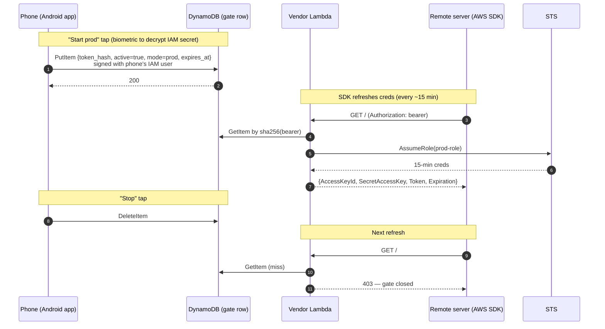

# phone-aws-auth

Toggle AWS access on a remote machine from your phone. Choose **prod** or **sandbox**. Tap once to open the gate, tap again to close it.

The phone never holds long-lived AWS credentials. The remote machine never holds long-lived AWS credentials. Both hold short, narrowly-scoped tokens. AWS-side roles do all the privileged work, and the phone just flips a flag that decides whether those roles will mint short-lived STS sessions for the machine.

---

## Problem

A remote server (a dev box, a Hetzner VM, a Codespace, an LLM agent runtime, etc.) sometimes needs AWS access for specific tasks, but most of the time should have none. Long-lived keys on the server are unacceptable; logging into the server to paste fresh keys is annoying.

We want:

1. Open the phone, tap "Start prod" (or "Start sandbox") → server has AWS access.
2. Tap "Stop" → server loses access.
3. Phone is the only place where the *authority* to grant access lives. Losing the server doesn't expose the AWS root account; losing the phone doesn't expose AWS credentials either (see [Security model](#security-model)).

---

## Architecture



Three things to note:

- The **phone never talks to the server** and the server never talks to the phone. They communicate indirectly through AWS (DynamoDB + Lambda). Server can be on a network with no inbound connectivity.
- The **server's bearer token is stable** — set once at provisioning, never rotated by normal operation. Only the gate row changes.
- The **SDK auto-refreshes** creds because we speak the [ECS container-credentials protocol](https://docs.aws.amazon.com/sdkref/latest/guide/feature-container-credentials.html). The server never sees creds older than 15 minutes.
- The phone talks to DynamoDB directly using AWS SDK + IAM SigV4. An IAM policy restricts the phone's user to `Put/Delete/GetItem` on the single gate row — see [Security model](#security-model).

---

## Components

| Component             | Hardcoded name             | Purpose                                                      |
|-----------------------|----------------------------|--------------------------------------------------------------|
| CloudFormation stack  | `phone-aws-auth`           | Single stack containing everything below                     |
| Region                | `eu-west-1`                | Single region for MVP                                        |
| DynamoDB table        | `phone-aws-gate`           | Stores the open/closed gate row, keyed by `token_hash`       |
| Vendor Lambda         | `phone-aws-vendor`         | Server hits this for fresh STS creds                         |
| IAM user (controller) | `phone-aws-controller`     | Phone authenticates as this user to write the gate row       |
| Prod role             | `phone-aws-prod-role`      | Role the vendor assumes when `mode=prod`                     |
| Sandbox role          | `phone-aws-sandbox-role`   | Role the vendor assumes when `mode=sandbox`                  |
| Lambda execution role | `phone-aws-lambda-role`    | Execution role for the vendor Lambda                         |

### Why hardcoded?

To eliminate one whole class of configuration error. The Android app, the deploy scripts, and the IAM policies all reference these names directly. If you deploy this stack to your own AWS account, **you must use these exact names**, otherwise the app's startup health check will fail and refuse to operate.

If you need multiple deployments in the same account (e.g. one per dev), that's a future-work item — see [Open questions](#open-questions).

---

## Security model

This is the core of the design. Read carefully.

### What the phone stores

| Item                        | Where stored                                              | If phone is stolen                                          |
|-----------------------------|-----------------------------------------------------------|-------------------------------------------------------------|
| IAM access key ID + secret  | `EncryptedSharedPreferences`, biometric-gated decryption  | Attacker needs biometric (or PIN/password) to decrypt       |
| AWS region                  | App preferences (plaintext)                               | Not secret                                                  |
| Gate row key (`token_hash`) | App preferences (plaintext)                               | Not secret — it's a hash of the server's bearer             |
| Cached gate status          | App preferences (plaintext)                               | Not secret — just a UI hint                                 |
| Server bearer token         | **Never**                                                 | N/A                                                         |

The phone has exactly one secret: the **IAM user's access key + secret**. These are stored encrypted using a master key in the Android Keystore that requires biometric (or device credential) authentication to release. Each `start`/`stop`/`status` operation triggers a biometric prompt before the SDK can sign the DynamoDB request.

The IAM user (`phone-aws-controller`) has a policy that **only** allows `dynamodb:PutItem | DeleteItem | GetItem` on the single gate row in `phone-aws-gate`. It cannot read other rows, touch other tables, see any other AWS service. The worst an attacker with extracted creds can do is toggle the gate.

**Lost phone → revoke in one CLI call:**

```sh
aws iam update-access-key --user-name phone-aws-controller \
    --access-key-id <AKID> --status Inactive
```

The old credentials become useless instantly — no redeploy, no waiting, no manual env-var rotation. This native AWS revocation path is the main reason we chose IAM-direct over an HMAC-signed control Lambda (see [Major pivot](#major-pivot-from-hmac--control-lambda-to-iam-direct-2026-05-21) in the decisions log).

### What the server stores

| Item                                       | Where                                | Notes                              |
|--------------------------------------------|--------------------------------------|------------------------------------|
| `AWS_CONTAINER_CREDENTIALS_FULL_URI`       | Env var (or `~/.aws/config`)         | The vendor Lambda's function URL   |
| `AWS_CONTAINER_AUTHORIZATION_TOKEN`        | Env var                              | The bearer token                   |

That's it. The server holds a static bearer token that, *by itself*, can do nothing — the gate is closed by default. The bearer only becomes useful while the phone has the gate open, and even then it only mints 15-minute STS sessions.

If the server is compromised:

- Attacker can call the vendor Lambda but gets 403 unless the gate happens to be open at that moment.
- If the gate *is* open when the server is compromised, the attacker gets 15-min creds for whichever role is active (prod or sandbox). Same exposure as if you'd put AWS keys on the server temporarily — but limited to the window when you happen to be granting access.
- Rotation: change the bearer token's `token_hash` in DynamoDB (which means re-pairing the phone with a freshly generated bearer); update the server's env var.

### What lives on the operator's laptop

| Item                              | When needed              | Notes                                                              |
|-----------------------------------|--------------------------|--------------------------------------------------------------------|
| AWS admin credentials             | Deploy / rotate / repair | Use [aws-token-vending-machine][tvm] to mint these short-lived     |
| Generated bearer token            | At deploy time only      | Shown once. Paste into the server's env. Then delete from laptop. |
| Generated IAM access key + secret | At pairing time only     | Shown once as QR code. Phone scans. Then delete from laptop. Can also be re-issued by rotating the IAM access key. |

[tvm]: https://github.com/alexeygrigorev/aws-token-vending-machine

### Threat scenarios

| Threat                                  | Outcome                                                                                          |
|-----------------------------------------|--------------------------------------------------------------------------------------------------|
| Phone lost, locked                      | IAM secret is encrypted at rest behind biometric/PIN. Attacker needs to unlock the device first. |
| Phone lost, unlocked, no biometric set  | Attacker decrypts IAM creds, can flip the gate. Cannot mint AWS creds (needs server bearer). Revoke via `aws iam update-access-key`. |
| Phone lost, coerced biometric           | Attacker decrypts IAM creds, flips the gate, can exfiltrate the access key for later use until you revoke. Same blast radius as having the unlocked phone (toggle gate only). |
| Rooted phone, attacker dumps memory     | At signing time the access key is in process memory and could be extracted. Mitigation: revoke immediately, rotate. |
| Server fully compromised                | Attacker has bearer, but gate is usually closed → 403. When opened: 15-min creds for current mode. Same blast radius as a brief direct credential grant. |
| Vendor Lambda compromised               | Bad. IAM blast radius is still bounded by prod/sandbox role policies — that's why those policies should stay narrow. |
| DynamoDB row tampered                   | Only the vendor Lambda role, the phone's controller user, and the operator's AWS admin can write to the table. The phone's user is locked to one row via `dynamodb:LeadingKeys`. |
| Operator account compromised            | Same as if the AWS root account were compromised. Out of scope — the whole stack assumes the operator's AWS account is trustworthy. |

### Why a narrow IAM user and not OAuth / Cognito / mTLS / HMAC

- **IAM user + scoped policy** uses AWS-native auth. No extra moving parts (no control Lambda, no auth module, no nonces table). Revocation is one CLI call.
- **HMAC** was the original design (see [Major pivot](#major-pivot-from-hmac--control-lambda-to-iam-direct-2026-05-21)). It's strictly stronger at rest (key hardware-bound in StrongBox, never extractable) but requires an entire control Lambda, an auth module, and a nonces table to make use of. And the HMAC secret has no AWS-native revoke story — you must redeploy or manually rotate a Lambda env var.
- **OAuth / Cognito** is another whole identity stack for a single-user toy. Buys nothing we need.
- **mTLS** is painful to provision on Android.
- **Trade-off:** the IAM access key has to live in process memory at signing time (the AWS SDK needs it to compute SigV4). A rooted phone with a memory dumper could exfiltrate it. We accept this trade-off because the policy is locked to one row, and revocation is instant if compromise is suspected.

---

## Operational details

### Startup health check

When the Android app launches, it calls `GetItem` on the gate row in the hardcoded `phone-aws-gate` table. Three outcomes:

| DynamoDB response                | App behaviour                                                                       |
|----------------------------------|--------------------------------------------------------------------------------------|
| `200`, row present               | Gate is open. Show current state, enable Stop. Start buttons remain available.       |
| `200`, no row                    | Gate is closed. Show "inactive". Enable Start buttons.                               |
| `ResourceNotFoundException`      | Table doesn't exist → "stack not deployed correctly". Refuse to expose Start/Stop.   |
| `AccessDeniedException`          | IAM creds wrong or revoked → "re-pair the phone".                                    |
| Network/auth failure             | Show error, retry button.                                                            |

The check is self-validating: a successful `GetItem` proves the stack is deployed, the IAM user is valid, and the row key is correct. No separate "/status" endpoint is needed.

### Stop semantics

`POST /stop` deletes the gate row in DynamoDB. The vendor Lambda's next call returns 403. The AWS SDK on the server sees the 403 on its next scheduled refresh (within 15 minutes), at which point any in-flight AWS calls will start failing.

**Default mode**: graceful — existing 15-minute creds finish out their natural life. The server's running processes get up to 15 minutes of stale-but-valid AWS access after you tap Stop.

**Instant kill** (optional, opt-in via a setting): in addition to deleting the row, the panic-button path attaches a deny policy to the active role with an `aws:TokenIssueTime < now` condition. Every live session for that role is invalidated immediately. On next "Start" the policy is removed. We do not enable this by default because the deny policy edits live IAM and is more invasive; it's a panic button — and the phone's IAM user would need an extra permission to do it, which broadens the blast radius if the phone is lost. Likely it'll live in a separate operator-only script rather than the phone app.

### Session duration & auto-refresh

- **STS session duration**: 900 seconds (15 minutes — the STS minimum). Hardcoded.
- The AWS SDK on the server uses the [container credentials provider chain](https://docs.aws.amazon.com/sdkref/latest/guide/feature-container-credentials.html). It automatically re-fetches before expiry, transparent to user code.
- The server's session can therefore last as long as the gate is open, regardless of the 15-minute STS limit.

### Gate TTL safety net

The gate row has a `expires_at` field which is also the DynamoDB TTL attribute. If you tap Start with `duration_minutes=60`, the row is written with `expires_at=now+3600`. If you forget to tap Stop and your phone dies, DDB TTL will delete the row within roughly 48 hours (TTL is not instant — typically tens of minutes, but AWS guarantees only "within 48 hours"). The vendor Lambda also checks `expires_at > now` on every call, so the gate is effectively closed the moment `expires_at` passes even if the row hasn't been deleted yet.

### Sessions and per-tap duration

The default tap opens the gate for 60 minutes. The Android app has a duration picker (15min / 1h / 4h / 8h) — the value translates into `expires_at = now + duration` on the row. The client validates the duration (max 24 hours) to limit the damage of a coerced tap. The vendor also enforces the cap by ignoring rows whose `expires_at` is past — so even if the client wrote a far-future `expires_at`, the rest of the system still works.

### One server per deployment (MVP)

This MVP supports exactly one server per stack. The gate row is keyed by `token_hash`, which is conceptually multi-server-ready, but the Android app's UI assumes a single gate. See [Open questions](#open-questions).

---

## Bootstrap & deploy

You will need:

- An AWS account (the management/main account, or a sub-account you control)
- AWS admin credentials *temporarily*, on your laptop, only during deploy
- A phone running Android 9+ (API 28+) with a biometric sensor
- The remote server you want to grant access to

### Steps

1. **(Optional) Create a sandbox account** using [aws-token-vending-machine][tvm]'s `setup-sandbox` command. This gives you a separate AWS account for the `phone-aws-sandbox-role` to live in, so prod and sandbox are physically isolated. You can also point both roles at the same account for MVP simplicity.

2. **Deploy the stack** from this repo:

   ```sh
   ./deploy.sh
   ```

   Outputs (shown once):
   - Vendor Lambda URL
   - Server bearer token
   - Phone IAM access key ID + secret (as a QR code in the terminal)
   - Gate row key (sha256 of the server bearer)

3. **Configure the server**:

   ```sh
   export AWS_CONTAINER_CREDENTIALS_FULL_URI='<vendor-url>'
   export AWS_CONTAINER_AUTHORIZATION_TOKEN='<bearer-token>'
   ```

   Persist these in your service's env / systemd unit / `.bashrc` — wherever makes sense for that server.

4. **Pair the phone**: open the Android app, tap "Pair", scan the QR code. The QR contains: AWS region, IAM access key ID, IAM secret, gate row key. The app stores these in `EncryptedSharedPreferences` behind a biometric-gated master key. The QR is then invalidated (you can delete it from the laptop).

5. **Verify**: app launches, runs the startup health check (a `GetItem` on the gate row), shows two big buttons.

### Customizing IAM permissions

The two roles' permissions are in `infra/permissions/prod-policy.json` and `infra/permissions/sandbox-policy.json`. Edit those before `./deploy.sh`.

The defaults are intentionally narrow:
- **sandbox**: full access in a dedicated AWS account (since blast radius is bounded by the account).
- **prod**: read-mostly + specific write scopes you opt into. Defaults to *deny all* — you must explicitly add what you need.

---

## Repo layout

```
phone-aws-auth/
├── README.md
├── pyproject.toml                  # Python project: Lambdas + shims + tools
├── deploy.sh                       # one-shot deploy of the CloudFormation stack
├── src/
│   └── phone_aws_auth/             # shared package: vendor handler + helpers
│       ├── config.py               # hardcoded names (table, lambdas, roles)
│       ├── gate.py                 # DynamoDB read/write (used by vendor)
│       └── handlers/
│           └── vendor.py           # Lambda handler: mint creds
├── shims/                          # FastAPI wrapper that runs the vendor locally
│   └── vendor_shim.py
├── docker/
│   ├── docker-compose.yml          # DDB Local + bootstrap + shims + test-server
│   ├── bootstrap_ddb.py            # creates the gate table on startup
│   └── test-server/
│       ├── Dockerfile
│       └── loop.sh                 # periodic curl, logs 200/403
├── infra/
│   ├── template.yaml               # CFN: table, lambdas, roles, function URLs
│   └── permissions/
│       ├── prod-policy.json
│       └── sandbox-policy.json
├── android/                        # native Kotlin / Jetpack Compose app
│   └── ...
└── tools/
    └── pair-qr.py                  # renders the pairing QR after deploy
```

**Why a Python package, not `lambda/<name>/index.py` zip layout:** keeping handlers in a single package lets the local shim and Lambda code share helpers (config, gate) without duplicating them. The deploy script packages the vendor Lambda by zipping the `phone_aws_auth` package plus a small `index.py` entry point that calls into `phone_aws_auth.handlers.vendor.handler`.

---

## Testing

Two test loops — a fast local one with no AWS, and a slow end-to-end one with real AWS.

### Local loop (no AWS, no money, no waiting)

The vendor Lambda is a pure Python function; we wrap it in a thin FastAPI shim and run it locally. DynamoDB is replaced with [DynamoDB Local](https://docs.aws.amazon.com/amazondynamodb/latest/developerguide/DynamoDBLocal.html) in Docker. STS is mocked — the vendor returns fake creds, the goal is to exercise the wire protocol, not validate IAM.

```
┌─────────────────────────────┐
│  Android emulator (Pixel)   │── tap Start/Stop
│  app uses AWS SDK directly  │
└─────────────────────────────┘
              │
              │ DDB protocol (PutItem/DeleteItem/GetItem)
              │ DDB Local accepts any creds — no IAM in local mode
              ▼
┌─────────────────────────────┐
│  DynamoDB Local             │── docker run amazon/dynamodb-local
│  host port 18000 → 8000     │
└─────────────────────────────┘
              ▲
              │ DDB protocol (vendor reads the gate row)
┌─────────────────────────────┐
│  vendor-lambda-local        │── FastAPI wrapper around phone_aws_auth.handlers.vendor
│  port 8002                  │── STS calls mocked, returns fake creds
└─────────────────────────────┘
              ▲
              │ GET /  Authorization: <bearer>
┌─────────────────────────────┐
│  test-server (Docker)       │── boto3 + ECS provider chain, real SDK loop
│  env: AWS_CONTAINER_*       │── logs creds resolved / gate-closed
└─────────────────────────────┘
```

`make dev-up` starts everything (DDB Local, the vendor shim, the boto3 test-server). `make dev-down` tears it down. The Android emulator reaches the laptop's DDB Local via `10.0.2.2:18000` (Android's magic loopback alias). The CLI (`make start-sandbox` / `make stop` / `make status`) writes directly to DDB Local from the host.

This gives a sub-second dev loop: edit Lambda code, restart the FastAPI shim, retry from the app. The Docker test-server is a small Python script that loops every 5 seconds and prints whether it currently has access — perfect for live-watching a Start/Stop transition.

**What the test-server actually validates.** It uses boto3 and the standard ECS container-credentials env vars (`AWS_CONTAINER_CREDENTIALS_FULL_URI` + `AWS_CONTAINER_AUTHORIZATION_TOKEN`) — the same code path a real AWS SDK on a real server would use. So we're not just checking HTTP wire format; we're proving that the SDK's credential-resolution pipeline finds our vendor, parses the response, and treats the result as ECS-style creds. With the gate open, it logs `creds resolved: ASIA-FAKE-SANDBOX`; with the gate closed it surfaces `403 Gate closed` from the provider. STS itself is mocked (fake creds, no real IAM calls); set `TRY_STS=1` in the test-server env to additionally invoke `sts:GetCallerIdentity` against real AWS, which will fail with `InvalidClientTokenId` and prove the SDK signs requests with the resolved creds.

> boto3 has a host-allowlist on `AWS_CONTAINER_CREDENTIALS_FULL_URI` for `http://`. In production this is fine because Lambda Function URLs are HTTPS (allowlist-exempt). For the local docker setup, the test-server shares the vendor's network namespace (`network_mode: service:vendor`) so it can reach the vendor at `http://127.0.0.1:8002/` — a loopback address, which is allowed.

### End-to-end loop (real AWS)

Once the local loop is green:

```
┌─────────────────────────────┐
│  Android emulator (Pixel)   │
└──────────────┬──────────────┘
               │ DDB protocol over HTTPS (SigV4 with phone IAM creds)
               ▼
┌─────────────────────────────┐
│  AWS                        │
│   vendor Lambda (real)      │
│   DynamoDB (real)           │
│   IAM user phone-aws-controller │
│   prod-role / sandbox-role  │
└──────────────┬──────────────┘
               ▲ Authorization: bearer
               │
┌──────────────┴──────────────┐
│  test-server (Docker)       │── env points at real vendor Lambda URL
└─────────────────────────────┘
```

`make e2e-up` deploys the stack (if not already deployed) and starts the Docker test-server pointed at the real vendor URL. You scan the QR with the emulator, tap Start sandbox, watch the Docker container's logs show `sts:GetCallerIdentity` succeeding, tap Stop, watch it start failing on the next refresh.

Costs: pennies. Lambda + DynamoDB on-demand for a few invocations is well within free tier.

### Running the emulator headlessly (CI / sandbox dev)

For environments without a desktop (e.g. running tests in a remote dev box):

```sh
emulator -avd Pixel_6_API_34 -no-window -no-audio -no-snapshot &
adb wait-for-device
adb install app/build/outputs/apk/debug/app-debug.apk
adb shell am start -n com.alexeygrigorev.phoneawsauth/.MainActivity
adb exec-out screencap -p > screen.png   # observe state
adb shell input tap 540 1200             # drive UI
```

Pairing without a physical QR scan: the app has a hidden dev-mode "paste pairing string" option (enabled by a long-press on the Pair button). The pairing string is the same data the QR encodes, just as text. CI uses this path; humans use the QR.

### Test matrix

| Layer                          | Tool                                | What it catches                                    |
|--------------------------------|-------------------------------------|----------------------------------------------------|
| AWS SDK call construction      | JUnit on JVM                        | Region, table name, row-key plumbing, error mapping |
| Request/response models        | Kotlin serialization round-trip     | Wire format drift                                  |
| Lambda handler logic           | pytest, `moto` for AWS mocks        | DynamoDB row logic, role selection, error paths    |
| Local end-to-end               | `make dev-up` + manual emulator     | Wire-protocol correctness, UI flow                 |
| Real end-to-end                | `make e2e-up`                       | IAM permissions, function URLs, real STS behaviour |
| Headless e2e                   | `adb` driving emulator              | Eventual CI smoke test                             |

---

## Decisions & rejected alternatives

A log of the choices we made and what we considered. Useful when reopening this project months from now or onboarding someone new.

### Major pivot: from HMAC + control Lambda to IAM-direct (2026-05-21)

The very first version of this project (commit `4387571`) had a control Lambda that the phone called over HTTPS, authenticated with HMAC-SHA256 + timestamp + nonce, with a dedicated `phone-aws-nonces` DynamoDB table for replay protection. After getting that fully working end-to-end (smoke test green, ~400 lines of control-plane code), we questioned whether the complexity was worth it. The walk-through:

- **Observation:** the vendor side (Lambda + gate row in DDB) is identical to the original `aws-credentials-vending-machine`. The "complexity" was entirely in the control plane.
- **Observation:** the client needs *some* secret regardless of approach — the only question is what kind. HMAC key vs IAM access key.
- **HMAC's main win:** the key can be hardware-bound (Android StrongBox), so it cannot be exfiltrated even from a rooted phone. The signing operation happens inside the secure element.
- **IAM's main wins:** (1) AWS-native revocation — `aws iam update-access-key --status Inactive` kills the credential instantly. With HMAC you have to redeploy the stack or manually rotate the Lambda env var. (2) Drop the entire control Lambda, the `auth.py` module, the nonces table, and the HMAC ceremony. ~400 lines and one Lambda gone.
- **Crucial: the IAM blast radius can be made as narrow as the HMAC blast radius.** The IAM user gets a policy locked to `dynamodb:{Put,Delete,Get}Item` on a single row in a single table (via a `dynamodb:LeadingKeys` condition). Stolen creds let an attacker flip the gate. They can't read other tables, touch other services, or mint AWS creds — they still need the server's bearer for that.
- **Threat model trade-off:** The HMAC key in StrongBox cannot be extracted by a rooted/sophisticated attacker. The IAM secret has to live in memory at signing time (the AWS SDK computes SigV4 with the raw bytes), so a rooted phone with a memory dumper can exfiltrate it. For a non-rooted Android phone with biometric-gated decryption, the two designs are equivalent against realistic attacks (lost phone, coerced biometric).
- **Revocation tips the balance.** A lost phone with HMAC means redeploying the stack. With IAM it's one CLI call. Cheaper rotation makes "rotate when paranoid" a reasonable security posture, which compensates for the slightly weaker at-rest property.

**Decision:** removed HMAC + nonces + control Lambda. Phone (and CLI) writes the DDB gate row directly using a narrowly-scoped IAM user. Vendor Lambda is unchanged.

What this looks like in practice:
- IAM user `phone-aws-controller` with a policy condition on `dynamodb:LeadingKeys`.
- Phone holds `AccessKeyId` + `SecretAccessKey`, biometric-gated in `EncryptedSharedPreferences` on Android.
- Phone code: `boto3.resource("dynamodb").Table("phone-aws-gate").put_item({...})`. ~10 lines.
- Tests: same DDB Local stack, just no control shim. Phone client speaks DDB to local on port 18000.
- Real-AWS deploy: phone speaks DDB on the real endpoint with the user's keys. Same code path.

### Architectural decisions

| Decision                                                              | Rationale                                                                                                                |
|-----------------------------------------------------------------------|--------------------------------------------------------------------------------------------------------------------------|
| Build on `aws-credentials-vending-machine`, not `aws-token-vending-machine` | The former already solves auto-refresh via the ECS credential protocol. The latter pushes long-ish-lived creds to disk over SSH — loses auto-refresh, makes Stop messier (logging into the server to delete files). |
| Phone writes DDB gate row directly via boto3 (post-pivot)              | See "Major pivot" above. Removes the control Lambda, the HMAC module, and the nonces table. Phone holds an IAM user's keys scoped to one row. |
| Server uses ECS container-credentials protocol                        | Native AWS SDK support for auto-refresh. Server holds only a bearer token; SDK transparently re-fetches before expiry.   |
| Phone never talks to the server directly                              | Server can be on a network with no inbound connectivity. All coordination flows through AWS, which is reachable from both. |
| Phone holds a narrowly-scoped IAM access key (post-pivot)             | See [Major pivot](#major-pivot-from-hmac--control-lambda-to-iam-direct-2026-05-21). Earlier we had a hardware-bound HMAC key with no AWS-native revoke; we swapped for an IAM user with a one-row policy to get instant revocation via `aws iam update-access-key`. |
| Single static server bearer token, not rotated on each Start          | Avoids the phone needing to reach the server. Server config is set once at provisioning. The gate state lives in DynamoDB, not in the server. |
| One Lambda (vendor), not two                                          | Post-pivot the control Lambda was removed; the phone writes DDB directly. Earlier we had two Lambdas with different auth (bearer vs HMAC). |
| Hardcoded resource names                                              | Eliminates configuration error. Android app, deploy scripts, and IAM policies all reference the same constants. Startup health check verifies they exist. |
| Single AWS region (`eu-west-1`)                                       | Matches `aws-token-vending-machine` default. Multi-region adds no value for a single-user toy.                           |
| 15-minute STS sessions                                                | The STS minimum. Forces refresh churn, which is the lever Stop pulls on. Auto-refresh by SDK means no user-visible cost. |
| Graceful Stop by default, instant-kill opt-in                         | Graceful via row deletion is enough for almost every real situation. Instant-kill via `TokenIssueTime` deny policy edits live IAM; it's a panic button, not a default. |
| DynamoDB TTL on `expires_at`                                          | Safety net for "phone dies while gate is open". TTL is not instant but bounds the worst case. Vendor also checks `expires_at` on every call, so effective close is immediate. |

### Auth decisions

| Decision                                                              | Rationale                                                                                                                |
|-----------------------------------------------------------------------|--------------------------------------------------------------------------------------------------------------------------|
| Phone authenticates as a narrowly-scoped IAM user                     | AWS-native auth, AWS-native revocation (`update-access-key --status Inactive`). No extra services to operate. Policy is locked to one row in one table via `dynamodb:LeadingKeys`. |
| IAM secret encrypted at rest via `EncryptedSharedPreferences`         | Master key in Android Keystore, biometric-required-per-decrypt. Equivalent to biometric-gated HMAC signing for unrooted phones. |
| Considered and rejected: HMAC + control Lambda (the original design)  | Stronger at-rest (StrongBox-bound key can't be extracted) but ~400 lines of control-plane code and no AWS-native revoke. See [Major pivot](#major-pivot-from-hmac--control-lambda-to-iam-direct-2026-05-21). |
| Considered and rejected: OAuth / Cognito                              | Another service to operate, another set of secrets. Buys nothing we need.                                                |
| Considered and rejected: mTLS                                         | Provisioning client certs on Android is painful.                                                                          |

### Client-platform decisions

| Decision                                                              | Rationale                                                                                                                |
|-----------------------------------------------------------------------|--------------------------------------------------------------------------------------------------------------------------|
| Native Android (Kotlin + Jetpack Compose)                             | The user has an Android phone. Native gives us the Android Keystore, biometric prompt, push notifications (future), home-screen widgets (future). |
| Considered and rejected: PWA                                          | Web Crypto / WebAuthn don't compose cleanly with the AWS SDK's SigV4 path; no equivalent to `EncryptedSharedPreferences` for at-rest IAM secret storage. |
| Considered and rejected: HTTP Shortcuts app                           | Fine for a 5-minute MVP, but no biometric gating, no path to widgets/notifications. The user wanted to commit to native. |
| Min SDK: Android 9 (API 28)                                           | StrongBox available on API 28+; modern keystore APIs stable.                                                             |

### Operational decisions

| Decision                                                              | Rationale                                                                                                                |
|-----------------------------------------------------------------------|--------------------------------------------------------------------------------------------------------------------------|
| One server per deployment (MVP)                                       | Data model supports many; UI assumes one. Defer multi-server until needed.                                               |
| Sandbox role lives in a separate AWS account (optional)               | Bounds blast radius. Reuse `aws-token-vending-machine` `setup-sandbox` to create it. Single-account mode also supported. |
| Default Start duration: 60 minutes; max: 24 hours                     | Common case is "give it an hour to do its task". Cap prevents a coerced tap leaving the gate open for a week.            |
| Pairing via QR code in terminal                                       | Avoids ever sending the IAM access key + secret over the network. Operator runs deploy on laptop, phone scans the secret directly. |

---

## Open questions / future work

These are intentionally out of scope for MVP:

- **Multiple servers per deployment.** The data model supports it (gate row per `token_hash`); the Android UI does not. Would add a server list + per-server gate state.
- **Multiple deployments per AWS account.** Currently the hardcoded names collide. Would need a prefix or namespace.
- **Push notifications to phone** when the gate is opened/closed or when creds are fetched. Lets the operator notice anomalies (e.g. gate stays open longer than expected, server is fetching creds at 3am).
- **MFA on `/start`** — require a TOTP code from the phone before opening the prod gate, on top of biometric. Defense in depth against coerced unlock.
- **Audit log to S3** — every `/start`, `/stop`, vendor fetch, with timestamps and source IPs.
- **Per-mode session duration limits.** E.g. prod max 30min, sandbox max 8h.
- **Server-side wrapper command** (`with-aws s3 ls ...`) so agents must be explicit about when they're using AWS, rather than the env vars being ambient. Reduces accidental AWS calls during the gate's open window.
- **iOS app.** Same architecture, different client. Should "just work" against the same Lambdas.

---

## References

- [aws-credentials-vending-machine](https://github.com/alexeygrigorev/aws-credentials-vending-machine) — the architectural ancestor; the vendor Lambda design is reused from this.
- [aws-token-vending-machine](https://github.com/alexeygrigorev/aws-token-vending-machine) — bootstrap helper for creating sandbox Organizations accounts.
- [ECS container-credentials provider](https://docs.aws.amazon.com/sdkref/latest/guide/feature-container-credentials.html) — the AWS SDK feature that does the auto-refresh.
- [Revoking IAM role temporary credentials](https://docs.aws.amazon.com/IAM/latest/UserGuide/id_roles_use_revoke-sessions.html) — the `TokenIssueTime` deny-policy trick used by the instant-kill mode.
- [Android Keystore — hardware-backed keys](https://developer.android.com/privacy-and-security/keystore) and [`EncryptedSharedPreferences`](https://developer.android.com/topic/security/data) — what the phone uses to encrypt the IAM secret at rest behind biometric auth.
- [IAM condition keys for DynamoDB — `dynamodb:LeadingKeys`](https://docs.aws.amazon.com/amazondynamodb/latest/developerguide/specifying-conditions.html) — the IAM-policy primitive that locks the phone's user to a single row.
