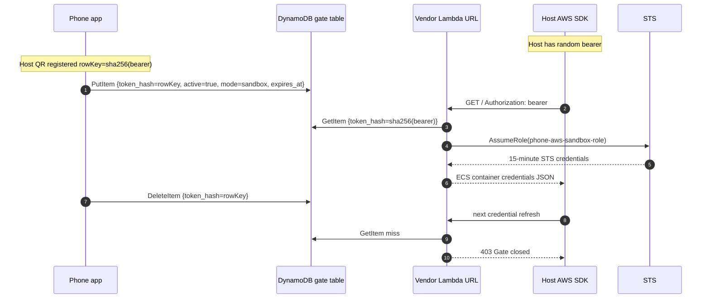

# AWS Gate

AWS Gate lets you open temporary sandbox AWS access for one or more remote machines from an Android phone.

Each host gets its own random bearer token and its own DynamoDB gate row. The phone app registers hosts by scanning a QR code generated on that host, then lets you select which host to open or close. The remote machine never stores long-lived AWS keys; it only stores a Lambda URL and its local bearer token. The phone stores the controller IAM key in Android encrypted storage and writes the gate row directly.

## Current Shape

- Sandbox-only: the vendable role is `phone-aws-sandbox-role` in the sandbox account.
- Multi-host: each host has a local bearer in `~/.config/aws-gate/env`; `rowKey = sha256(bearer)`.
- Any-shell AWS access: `./install-aws-gate-env.sh` configures `~/.aws/config` with `credential_process`, so AWS CLI/SDKs can resolve credentials without `.bashrc`.
- Phone app: registers host QRs, remembers hosts, shows the selected host, and starts/stops that host's gate.
- TTL safety: each Start writes `expires_at`; the Lambda refuses expired rows even before DynamoDB TTL cleanup runs.

## Quick Start

### 1. Clone On The Remote Machine

```sh
git clone git@github.com:alexeygrigorev/phone-aws-gate.git
cd phone-aws-gate
uv sync --all-extras --group dev
```

### 2. Use A Sandbox Account

Using a dedicated sandbox AWS account is recommended. It bounds the blast radius if a remote machine is compromised while its gate is open.

You can create or select the sandbox account however you prefer. `aws-sandbox-cli` / `aws-token-vending-machine` is the easiest setup path because it can create the sandbox environment and transfer temporary deploy credentials onto the remote machine. The CLI is only needed for setup; AWS Gate does not depend on it after deployment.

On the remote machine, export temporary deploy credentials for the sandbox account:

```sh
export AWS_ACCESS_KEY_ID=...
export AWS_SECRET_ACCESS_KEY=...
export AWS_SESSION_TOKEN=...
export AWS_DEFAULT_REGION=eu-west-1
```

### 3. Deploy The Stack

```sh
./deploy.sh
```

This creates or updates:

- DynamoDB table `phone-aws-gate`
- Lambda Function URL `phone-aws-vendor`
- IAM role `phone-aws-sandbox-role`
- IAM user `phone-aws-controller`
- Lambda execution role `phone-aws-lambda-role`

The deploy writes controller metadata to `.runtime/controller.json`. That file is gitignored and contains the phone controller IAM secret.

### 4. Install AWS Gate On A Host

Run this on each host you want the phone to control:

```sh
./install-aws-gate-env.sh
```

It creates:

- `~/.config/aws-gate/env`: host-local bearer token and Lambda URL
- `~/.aws/config`: default profile with `credential_process`

No `.bashrc` or shell startup hook is required. In a fresh shell, AWS CLI/SDKs should show credentials from `custom-process` when the host gate is open:

```sh
aws configure list
aws sts get-caller-identity
```

When the gate is closed, SDK credential resolution fails with `HTTP 403`.

### 5. Register The Host In The Phone App

Generate the host QR:

```sh
./pair-qr.sh
```

Open AWS Gate on the Android phone, tap Pair, and scan the QR. The QR contains the host name, host row key, region/table, and the phone controller IAM key. It does not contain the host bearer token.

Repeat `./install-aws-gate-env.sh` and `./pair-qr.sh` on each host. The app stores registered hosts and lets you select which one to control.

### 6. Open And Close Access

In the app:

1. Select the host.
2. Pick a TTL: 15m, 1h, 4h, or 8h.
3. Tap Start and complete biometric auth.
4. Run AWS CLI/SDK commands on that host.
5. Tap Stop to close the gate.

Already-issued STS credentials can remain valid until their 15-minute expiry. New refreshes fail after Stop or after the TTL expires.

## Architecture



The phone never talks to the host, and the host never talks to the phone. They coordinate through DynamoDB and the Lambda URL.

## Security Model

### Phone

The phone stores registered host configs in `EncryptedSharedPreferences`, backed by Android Keystore:

- host name
- region/table
- row key (`sha256(host bearer)`)
- controller IAM access key ID and secret

The phone never stores the host bearer token. Start/Stop operations require Android biometric auth.

The controller IAM user can `GetItem`, `PutItem`, and `DeleteItem` in the `phone-aws-gate` table. That means a stolen unlocked phone can toggle registered host rows, but it still cannot mint AWS credentials without a host bearer.

To revoke phone access:

```sh
aws iam update-access-key \
  --user-name phone-aws-controller \
  --access-key-id <controller-access-key-id> \
  --status Inactive
```

### Host

The host stores:

- Lambda Function URL
- host-local bearer token

The bearer alone cannot access AWS. It only works while the matching DynamoDB row is open. If copied to another machine, that machine is controlled by the same registered host entry, so treat `~/.config/aws-gate/env` as sensitive.

To rotate one host:

```sh
rm ~/.config/aws-gate/env
./install-aws-gate-env.sh
./pair-qr.sh
```

Then register the new QR in the phone app.

### AWS

The Lambda hashes the incoming bearer and reads that exact gate row. If the row is missing, inactive, expired, or has an unsupported mode, it returns 403/500 and does not call STS.

The vendable sandbox role policy is currently broad (`Action: "*"`, `Resource: "*"`) because the recommended deployment target is a dedicated sandbox account. Narrow `phone-aws-sandbox-role` in `infra/template.yaml` if the sandbox account is shared or contains important resources.

## Operational Details

- Stack name: `phone-aws-auth`
- Region: `eu-west-1`
- Table: `phone-aws-gate`
- Vendor Lambda: `phone-aws-vendor`
- Controller user: `phone-aws-controller`
- Sandbox role: `phone-aws-sandbox-role`
- STS duration: 900 seconds
- Gate TTL options in app: 15m, 1h, 4h, 8h
- Max gate duration enforced by clients: 24h

## Useful Commands

Render this host's QR:

```sh
./pair-qr.sh
```

Render JSON instead of a terminal QR:

```sh
./pair-qr.sh --json
```

Use a custom host name in the QR:

```sh
./pair-qr.sh --name hetzner
```

Install/update the host credential provider:

```sh
./install-aws-gate-env.sh
```

Check which provider AWS CLI is using:

```sh
aws configure list
```

## Development And Tests

Backend checks:

```sh
uv run pytest -q
uv run cfn-lint infra/template.yaml
bash -n deploy.sh install-aws-gate-env.sh pair-qr.sh
python3 -m py_compile tools/install_aws_gate.py tools/pair_qr.py
```

Android checks:

```sh
cd android
./gradlew testDebugUnitTest assembleDebug --no-daemon
```

Local Docker loop:

```sh
make dev-up
make start-sandbox
make stop
make dev-down
```

## Repo Layout

```text
phone-aws-auth/
├── android/                    # Kotlin / Jetpack Compose Android app
├── docker/                     # DDB Local + vendor shim + test server
├── infra/template.yaml         # CloudFormation stack
├── src/phone_aws_auth/         # Vendor handler + shared backend helpers
├── tests/                      # Python backend tests
├── tools/
│   ├── install_aws_gate.py     # host installer + credential_process + QR payload
│   ├── pair_qr.py              # QR renderer
│   └── phone_client.py         # CLI/test client for DDB gate row
├── deploy.sh
├── install-aws-gate-env.sh
└── pair-qr.sh
```

## CI And Releases

GitHub Actions runs backend checks and Android debug builds on pushes and pull requests. Pushing a `v*` tag also creates/updates a GitHub Release and attaches the debug APK as:

```text
phone-aws-auth-<tag>-debug.apk
```

## Future Work

- Better host list UI: rename hosts, delete hosts, show more status per host.
- Per-host TTL defaults.
- Warning/prompt near TTL expiry to prolong the session.
- Push/audit events when a host fetches credentials.
- Optional instant-kill mode using IAM `TokenIssueTime` deny policy.
- Server wrapper command such as `with-aws ...` for more explicit AWS usage.
- iOS app.

## References

- [aws-credentials-vending-machine](https://github.com/alexeygrigorev/aws-credentials-vending-machine)
- [aws-token-vending-machine](https://github.com/alexeygrigorev/aws-token-vending-machine)
- [ECS container credentials provider](https://docs.aws.amazon.com/sdkref/latest/guide/feature-container-credentials.html)
- [Android Keystore](https://developer.android.com/privacy-and-security/keystore)
- [EncryptedSharedPreferences](https://developer.android.com/topic/security/data)
