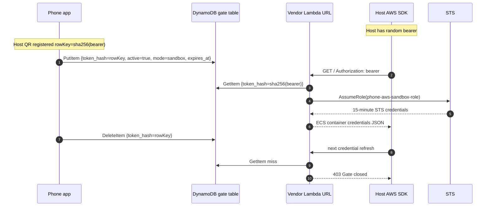

# AWS Gate

AWS Gate lets you open temporary sandbox AWS access for one or more remote machines from an Android phone.

Each host gets its own random bearer token and its own DynamoDB gate row. The phone app registers hosts by scanning a QR code generated on that host, then lets you select which host to open or close. The remote machine never stores long-lived AWS keys; it only stores a Lambda URL and its local bearer token. The phone stores the controller IAM key in Android encrypted storage and writes the gate row directly.

## Current Shape

- Sandbox-only: the vendable role is `phone-aws-sandbox-role` in the sandbox account.
- Account setup is one-time: deploy the AWS Gate CloudFormation stack once per AWS account or sandbox account you want to use.
- Multi-host: each host has a local bearer in `~/.config/aws-gate/env`; `rowKey = sha256(bearer)`.
- Host setup is per machine: install the credential provider and pair that host once.
- Multi-account: the phone app can store hosts from different AWS Gate deployments. Each host QR points at the account/stack that created it.
- Any-shell AWS access: `./install-aws-gate-env.sh` configures `~/.aws/config` with `credential_process`, so AWS CLI/SDKs can resolve credentials without `.bashrc`.
- Phone app: registers host QRs, remembers hosts, shows the selected host, and starts/stops that host's gate.
- TTL safety: each Start writes `expires_at`; the Lambda refuses expired rows even before DynamoDB TTL cleanup runs.

## Quick Start

### 1. Understand The Setup Model

There are two setup layers:

1. Once per AWS account: deploy the AWS Gate CloudFormation stack.
2. Once per host: install the local credential provider and pair that host with the phone app.

After that, normal usage is only: select host in the app, tap Start, run AWS CLI/SDK commands, tap Stop.

One stack can control many hosts in the same AWS account. A Lambda belongs to one stack and mints credentials for that stack's sandbox role. If you have two sandbox accounts, deploy the stack once in each account and pair hosts from both accounts into the same phone app. The app can store all of them.

Pairing is per host, not per account. Each host has its own bearer token and DynamoDB row. The phone opens/closes that host's row, and that host's AWS config calls the Lambda URL from the stack that created it.

Most AWS resource names are intentionally fixed: stack name, table name, Lambda name, controller user, and sandbox role name. That keeps pairing simple because the QR and host config only need to carry the values that differ per deployment or per host.

### 2. Clone On The Remote Machine

```sh
git clone git@github.com:alexeygrigorev/phone-aws-gate.git
cd phone-aws-gate
uv sync --all-extras --group dev
```

### 3. Prepare A Sandbox Account

Using a dedicated sandbox AWS account is recommended. It bounds the blast radius if a remote machine is compromised while its gate is open.

You can create or select the sandbox account however you prefer. The easiest path is [aws-sandbox-cli](https://github.com/alexeygrigorev/aws-sandbox-cli), which can create or verify an AWS Organizations sandbox account and mint temporary credentials for it. This helper is only needed for setup; AWS Gate does not depend on it after deployment.

On your workstation, create or verify the sandbox account once:

```sh
git clone https://github.com/alexeygrigorev/aws-sandbox-cli.git
cd aws-sandbox-cli
uv sync
cp .env.example .env
$EDITOR .env
uv run aws-sandbox-cli setup-sandbox
```

Then mint temporary sandbox credentials and send them to the remote machine:

```sh
uv run aws-sandbox-cli creds \
  --remote-host <ssh-host> \
  --remote-path '~/git/phone-aws-gate/.env'
```

On the remote machine, load those temporary credentials before deploying:

```sh
cd ~/git/phone-aws-gate
set -a; . ./.env; set +a
aws sts get-caller-identity
```

You only need this temporary deploy credential step when creating or updating the AWS Gate stack for that account.

### 4. Deploy The Stack

```sh
./deploy.sh
```

This creates or updates:

- DynamoDB table `phone-aws-gate`
- Lambda Function URL `phone-aws-vendor`
- IAM role `phone-aws-sandbox-role`
- IAM user `phone-aws-controller`
- Lambda execution role `phone-aws-lambda-role`

The deploy writes controller metadata to `.runtime/controller.json`. That file is gitignored and contains the phone controller IAM secret.

Repeat this deploy step only when you want to update the stack in that AWS account. You do not deploy again for every host.

### 5. Install AWS Gate On A Host

Run this on each host you want the phone to control:

```sh
./install-aws-gate-env.sh
```

It creates:

- `~/.config/aws-gate/env`: host-local bearer token and Lambda URL
- `~/.aws/config`: default profile with `credential_process`

More explicitly, the installer does this:

1. Reads `.runtime/controller.json`, which was written by `./deploy.sh`, to get the Lambda Function URL.
2. Generates a random bearer token for this host if one does not already exist.
3. Writes the Lambda URL, bearer token, and region to `~/.config/aws-gate/env`.
4. Computes this host's row key as `sha256(bearer)`. This row key is what the phone will later open or close in DynamoDB.
5. Backs up the existing `~/.aws/config` if it exists.
6. Writes the default AWS profile with a `credential_process` command:

```ini
[default]
region = eu-west-1
credential_process = python3 /path/to/phone-aws-gate/tools/install_aws_gate.py credential-process --env /home/user/.config/aws-gate/env
```

The host does not store AWS access keys. It stores only:

- the Lambda credential endpoint
- the host bearer token

When AWS CLI or an AWS SDK needs credentials, it runs the `credential_process` command from `~/.aws/config`. That command reads `~/.config/aws-gate/env`, calls the Lambda with the bearer token, and prints AWS credentials in the JSON format expected by AWS CLI/SDKs.

The Lambda hashes the bearer token, checks the matching DynamoDB gate row, and only calls STS if the phone has opened that row. If the row is closed, missing, or expired, the Lambda returns `403` and the host gets no credentials.

No `.bashrc` or shell startup hook is required. In a fresh shell, AWS CLI/SDKs should show credentials from `custom-process` when the host gate is open:

```sh
aws configure list
aws sts get-caller-identity
```

When the gate is closed, SDK credential resolution fails with `HTTP 403`.

### 6. Register The Host In The Phone App

Generate the host QR:

```sh
./pair-qr.sh
```

Open AWS Gate on the Android phone, tap Pair, and scan the QR. The QR contains the host name, host row key, region/table, and the phone controller IAM key. It does not contain the host bearer token.

If the terminal showing the QR is also on the phone, take a screenshot, open AWS Gate, tap Pair, then tap Import screenshot and select that image. The app decodes the QR from the screenshot. You can also use `./pair-qr.sh --json` and paste the JSON manually.

Repeat `./install-aws-gate-env.sh` and `./pair-qr.sh` on each host. The app stores registered hosts and lets you select which one to control.

### 7. Open And Close Access

In the app:

1. Select the host.
2. Pick a TTL: 15m, 1h, 4h, or 8h.
3. Tap Start and complete biometric auth.
4. Run AWS CLI/SDK commands on that host.
5. Tap Stop to close the gate.

Already-issued STS credentials can remain valid until their 15-minute expiry. New refreshes fail after Stop or after the TTL expires.

## Architecture



The phone never talks to the host, and the host never talks to the phone. They coordinate through DynamoDB and the Lambda URL.

## Security Model

### Phone

The phone stores registered host configs in `EncryptedSharedPreferences`, backed by Android Keystore:

- host name
- region/table
- row key (`sha256(host bearer)`)
- controller IAM access key ID and secret

The phone never stores the host bearer token. Start/Stop operations require Android biometric auth.

The controller IAM user can `GetItem`, `PutItem`, and `DeleteItem` in the `phone-aws-gate` table. That means a stolen unlocked phone can toggle registered host rows, but it still cannot mint AWS credentials without a host bearer.

To revoke phone access:

```sh
aws iam update-access-key \
  --user-name phone-aws-controller \
  --access-key-id <controller-access-key-id> \
  --status Inactive
```

### Host

The host stores:

- Lambda Function URL
- host-local bearer token

The bearer alone cannot access AWS. It only works while the matching DynamoDB row is open. If copied to another machine, that machine is controlled by the same registered host entry, so treat `~/.config/aws-gate/env` as sensitive.

To rotate one host:

```sh
rm ~/.config/aws-gate/env
./install-aws-gate-env.sh
./pair-qr.sh
```

Then register the new QR in the phone app.

### AWS

The Lambda hashes the incoming bearer and reads that exact gate row. If the row is missing, inactive, expired, or has an unsupported mode, it returns 403/500 and does not call STS.

The vendable sandbox role policy is currently broad (`Action: "*"`, `Resource: "*"`) because the recommended deployment target is a dedicated sandbox account. Narrow `phone-aws-sandbox-role` in `infra/template.yaml` if the sandbox account is shared or contains important resources.

## Operational Details

- Stack name: `phone-aws-auth`
- Region: `eu-west-1`
- Table: `phone-aws-gate`
- Vendor Lambda: `phone-aws-vendor`
- Controller user: `phone-aws-controller`
- Sandbox role: `phone-aws-sandbox-role`
- STS duration: 900 seconds
- Gate TTL options in app: 15m, 1h, 4h, 8h
- Max gate duration enforced by clients: 24h

## Useful Commands

Render this host's QR:

```sh
./pair-qr.sh
```

Render JSON instead of a terminal QR:

```sh
./pair-qr.sh --json
```

On-phone SSH flow:

```sh
./pair-qr.sh
# take a screenshot of the terminal QR
# AWS Gate -> Pair -> Import screenshot
```

Use a custom host name in the QR:

```sh
./pair-qr.sh --name hetzner
```

Install/update the host credential provider:

```sh
./install-aws-gate-env.sh
```

Check which provider AWS CLI is using:

```sh
aws configure list
```

## Development And Tests

Backend checks:

```sh
uv run pytest -q
uv run cfn-lint infra/template.yaml
bash -n deploy.sh install-aws-gate-env.sh pair-qr.sh
python3 -m py_compile tools/install_aws_gate.py tools/pair_qr.py
```

End-to-end tests:

```sh
make e2e
```

This runs the full reproducible e2e suite. The current e2e registers two host payloads in the emulator, opens only one host through the app UI, runs two Docker server containers against the local Lambda shim, and verifies that the open host receives credentials through a local fake STS while the closed host gets refused.
It then swaps the active host in the emulator UI and verifies that the two containers swap behavior. The script starts and stops the local Docker containers itself.

Android checks:

```sh
cd android
./gradlew testDebugUnitTest assembleDebug --no-daemon
```

Local Docker loop:

```sh
make dev-up
make start-sandbox
make stop
make dev-down
```

## Repo Layout

```text
phone-aws-auth/
├── android/                    # Kotlin / Jetpack Compose Android app
├── docker/                     # DDB Local + vendor shim + test server
├── infra/template.yaml         # CloudFormation stack
├── src/phone_aws_auth/         # Vendor handler + shared backend helpers
├── tests/                      # Python backend tests
├── tools/
│   ├── install_aws_gate.py     # host installer + credential_process + QR payload
│   ├── pair_qr.py              # QR renderer
│   └── phone_client.py         # CLI/test client for DDB gate row
├── deploy.sh
├── install-aws-gate-env.sh
└── pair-qr.sh
```

## CI And Releases

GitHub Actions runs backend checks and Android debug builds on pushes and pull requests. Pushing a `v*` tag also creates/updates a GitHub Release and attaches the debug APK as:

```text
phone-aws-auth-<tag>-debug.apk
```

## Future Work

- Better host list UI: rename hosts, delete hosts, show more status per host.
- Per-host TTL defaults.
- Warning/prompt near TTL expiry to prolong the session.
- Push/audit events when a host fetches credentials.
- Optional instant-kill mode using IAM `TokenIssueTime` deny policy.
- Server wrapper command such as `with-aws ...` for more explicit AWS usage.
- iOS app.

## References

- [aws-sandbox-cli](https://github.com/alexeygrigorev/aws-sandbox-cli)
- [ECS container credentials provider](https://docs.aws.amazon.com/sdkref/latest/guide/feature-container-credentials.html)
- [Android Keystore](https://developer.android.com/privacy-and-security/keystore)
- [EncryptedSharedPreferences](https://developer.android.com/topic/security/data)
